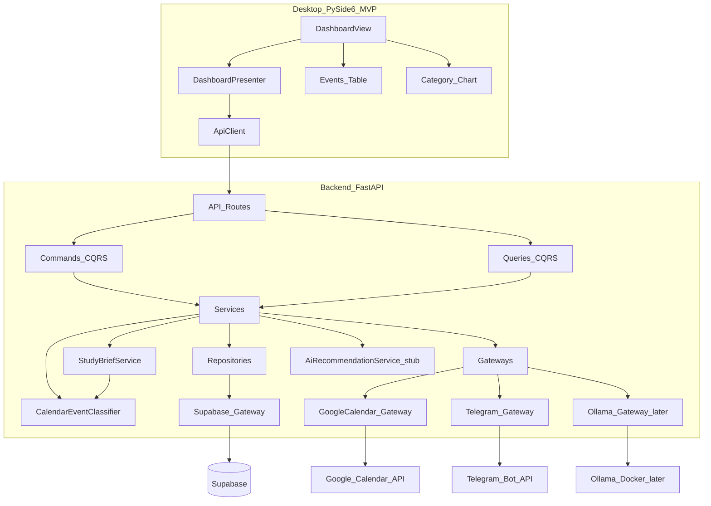

# Architecture

## Product direction

**AI Calendar Study Assistant** — PySide6 desktop app that syncs **Google Calendar** events, classifies them, builds study briefs, and sends them via **Telegram**. Built on the existing `ai-study-planner` repo (FastAPI, Supabase, Gateway/CQRS layers).

## System context

The desktop app **never** talks directly to Supabase, Google Calendar, Telegram, or Ollama. All external access goes through the **FastAPI backend** via **Gateway** classes.



## Desktop layer (PySide6, MVP)

| Package | Responsibility |
|---------|----------------|
| `views/` | Dashboard layout, buttons, status area, tables, charts |
| `presenters/` | Orchestration; calls `api_client`; handles errors for UI |
| `models/` | Desktop DTOs (calendar event, brief, demo user) |
| `widgets/` | Reusable event table, category chart |
| `api_client/` | HTTP client to FastAPI only |

### Dashboard actions (MVP)

| Button | Backend call |
|--------|----------------|
| Load Demo Student | `POST /users/demo` |
| Connect Google Calendar | `POST /calendar/connect` |
| Sync Google Calendar | `POST /calendar/sync` |
| Show Today Events | `GET /calendar/events/today` |
| Show Week Events | `GET /calendar/events/week` |
| Generate Today Brief | `POST /briefs/today` |
| Send Brief to Telegram | `POST /briefs/send-telegram` |

Connection status shown as: **Not connected** / **Connected** / **Credentials missing**.

**Rule:** No Supabase, Google, or Telegram SDK imports in `desktop/`.

## Backend layer (FastAPI, CQRS/MVC ideas)

| Package | Responsibility |
|---------|----------------|
| `api/` | Thin HTTP routes |
| `schemas/` | Pydantic models for events, briefs, responses |
| `cqrs/commands/` | Sync calendar, generate brief, send Telegram |
| `cqrs/queries/` | Get today events, get demo user |
| `services/` | `StudyBriefService`, `CalendarEventClassifier`, `AiRecommendationService` (stub) |
| `repositories/` | Supabase reads/writes via gateway |
| `gateways/` | Supabase, Google Calendar, Telegram, Ollama (later) |
| `rag/` | Deferred — placeholder for future RAG phase |

### Flow — Connect + sync Google Calendar (OAuth)

1. Desktop → `POST /calendar/connect` with `user_id`
2. `GoogleCalendarGateway` loads Desktop OAuth client JSON from `GOOGLE_CALENDAR_CREDENTIALS_PATH`
3. If no valid token: `InstalledAppFlow.run_local_server()` opens the browser
4. Refresh/access token saved to `local_tokens/google_calendar/<user_id>.json`
5. Desktop → `POST /calendar/sync` → gateway lists primary calendar events (read-only scope)
6. `CalendarEventClassifier` classifies title + description (English + Hebrew keywords)
7. Events cached in memory (deduped by `external_event_id`); `activity_events` logs `calendar_connected` / `calendar_synced`
8. Desktop → `GET /calendar/events/today` or `/week` → table populated

**No silent mock fallback.** Missing credentials or disconnected users get readable errors.

### Flow — Generate and send brief

1. Desktop → `POST /briefs/today`
2. `StudyBriefService` groups classified events into brief sections
3. Response returns brief text; optional persist to `ai_chat_history`
4. Desktop → `POST /briefs/send-telegram`
5. `TelegramGateway.send_message(chat_id, text)` using `users_profile.telegram_chat_id`
6. Log `brief_generated`, `telegram_sent` in `activity_events`

## Gateway pattern

**Gateway** means all external-service access is **centralized in one class per vendor**. Services and repositories depend on gateways; routes never import vendor SDKs directly.

| Gateway | External system | Status | Purpose |
|---------|-----------------|--------|---------|
| `SupabaseGateway` | Supabase | Implemented | DB, profiles, activity log |
| `GoogleCalendarGateway` | Google Calendar API + OAuth | Implemented | Per-user OAuth, list events |
| `TelegramGateway` | Telegram Bot API | Implemented | Send study brief |
| `OllamaGateway` | Ollama (Docker) | Later | AI recommendations stub → real later |

### Google OAuth storage

| Artifact | Path | Notes |
|----------|------|-------|
| OAuth client JSON | `GOOGLE_CALENDAR_CREDENTIALS_PATH` (default `secrets/google_calendar_credentials.json`) | Desktop app type; never commit |
| Per-user token | `GOOGLE_CALENDAR_TOKEN_DIR/<user_id>.json` | Auto-created after consent; never commit |
| Scope | `calendar.readonly` | Read-only |

Benefits: mock in tests, single config/retry point, clear course requirement demonstration.

### Supabase connection (existing)

[`SupabaseGateway`](../backend/app/gateways/supabase_gateway.py) — settings from `.env` (`SUPABASE_URL`, `SUPABASE_ANON_KEY`).

- `GET /health/supabase` — connectivity probe

## Calendar event classification

`CalendarEventClassifier` matches English + Hebrew keywords on **title and description** (prefix before `:` still wins when present):

| Category | Example keywords |
|----------|------------------|
| Exam | exam, quiz, midterm, בחינה, מבחן, בוחן |
| Assignment | assignment, homework, מטלה, תרגיל |
| Study | study, review, לימוד, חזרה, תרגול |
| Project | project, פרויקט |
| Class | class, lecture, שיעור, הרצאה |
| Meeting | meeting, standup, פגישה, ישיבה |
| Other | no keyword match |

Implemented in backend only (not in desktop).

## AI layer (placeholder — not heavy RAG yet)

`AiRecommendationService` — interface with stub method e.g. `suggest_focus(events) -> str` returning a static or rule-based hint. `OllamaGateway` wired in a later sprint; existing `rag/` package untouched until then.

## Data storage

### Supabase (PostgreSQL) — schema unchanged

Defined in [`backend/database/schema.sql`](../backend/database/schema.sql), already applied.

| Table | Pivot usage |
|-------|-------------|
| `users_profile` | Demo student, email, `telegram_chat_id` |
| `courses` | Optional; not primary for calendar MVP |
| `tasks` | Optional; manual tasks if time allows |
| `study_documents` | Deferred (RAG later) |
| `ai_chat_history` | Store generated brief text |
| `activity_events` | MVP Event Sourcing: sync, brief, telegram events |

Synced calendar events may live **in memory** or brief JSON for MVP until schema is extended.

### Other

- **Google Calendar** — source of truth for schedule (read via Gateway)
- **ChromaDB / RAG** — deferred

## Configuration

Environment variables (`.env` — never in code or docs):

| Variable | Purpose |
|----------|---------|
| `API_HOST`, `API_PORT` | Backend bind |
| `SUPABASE_URL`, `SUPABASE_ANON_KEY` | Supabase |
| `GOOGLE_CALENDAR_CREDENTIALS_JSON` or OAuth vars | Google Calendar (planned) |
| `TELEGRAM_BOT_TOKEN` | Telegram bot |
| `OLLAMA_BASE_URL` | Later phase |

## Security notes (MVP)

- Secrets only in backend `.env`
- Desktop → FastAPI only
- Demo user flow avoids full auth for deadline; RLS before production
- Do not expose tokens in README, logs, or API responses

## Repository layout

```text
ai-study-planner/
├── desktop/              # PySide6 MVP — dashboard module
├── backend/
│   ├── app/
│   │   ├── gateways/     # supabase, google_calendar, telegram, ollama
│   │   ├── services/     # brief, classifier, ai stub
│   │   └── ...
│   └── database/         # schema.sql (unchanged)
├── docs/
└── skills/               # calendar_study_agent_skill.md + architect skill
```
